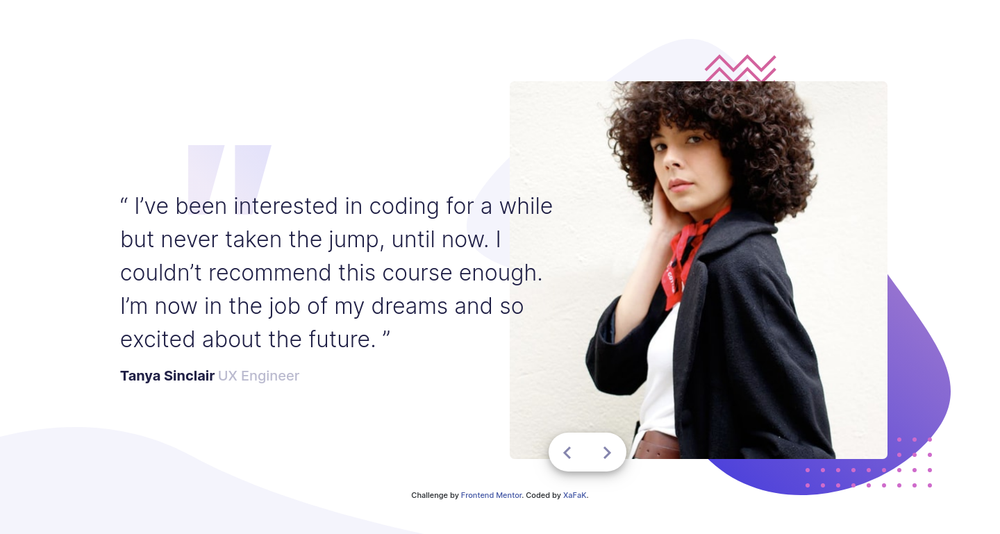
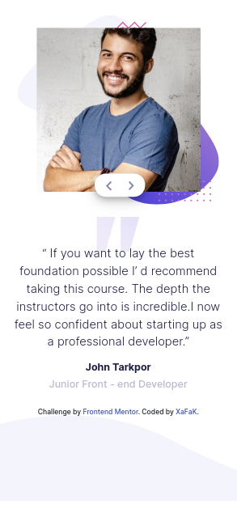

# FrontEndMentor-Coding_Bootcamp_Testimonials_Slider

## Desktop Preview

## Desktop Preview Animations

## Mobile Preview

## Mobile Preview Animations

## What is this?

This is a responsive, Mobile-first solution for Coding bootcamp testimonials slider using HTML, CSS Bootstrap Framework and jQuery (Javascript Library), a challenge from: [Frontend Mentor](https://www.frontendmentor.io).

## Which framework/library is used in this solution?

This solution uses CSS Bootstrap Framework and jQuery Javascript Library.

## How can I view the solution?

[Click here to view the live site](https://front-end-mentor-coding-bootcamp-testimonials-slider.now.sh/)
Hosted on [Versel](https://vercel.com/)
