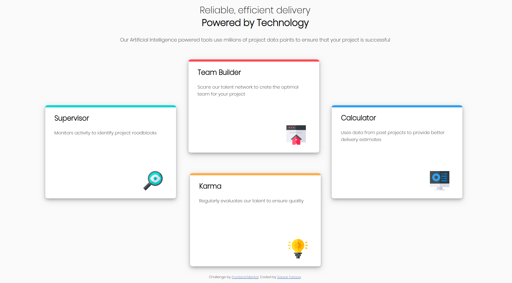

# FrontEndMentor-Four_Card_Feature_Section
Four Card Feature Section solution using simple HTML and CSS

## What is this?

This is a responsive, Mobile-first solution for Single Price Grid Component using CSS Bootstrap Framework and HTML challenge from: [Frontend Mentor](https://www.frontendmentor.io).

## Which framework is used in this solution?

This solution uses CSS Bootstrap Framework.
