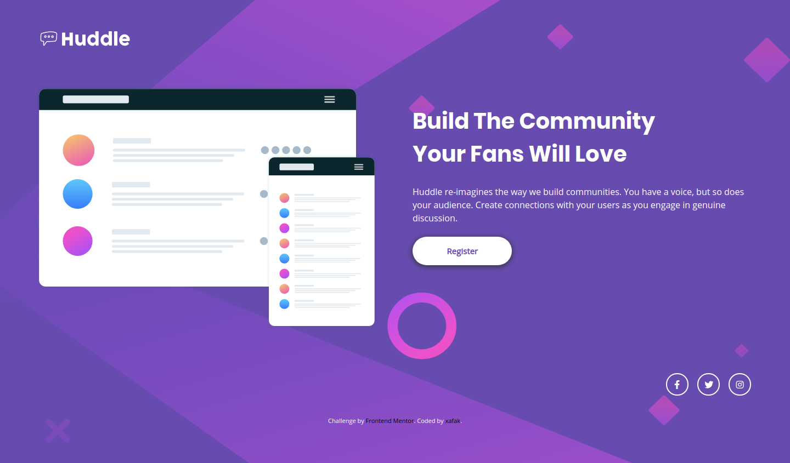

# Frontend Mentor - Huddle landing page with single introductory section

## Desktop Preview

## Mobile Preview

## What is this?

This is a responsive, Mobile-first solution for Huddle Landing Page With Single Introductory Section using CSS Bootstrap Framework and HTML, a challenge from: [Frontend Mentor](https://www.frontendmentor.io).

## Which framework is used in this solution?

This solution uses CSS Bootstrap Framework.

## How can I preview it?

[Click here to view the live site](https://front-end-mentor-huddle-landing-page-with-single-int.now.sh/)
Hosted on [Versel](https://vercel.com/)
