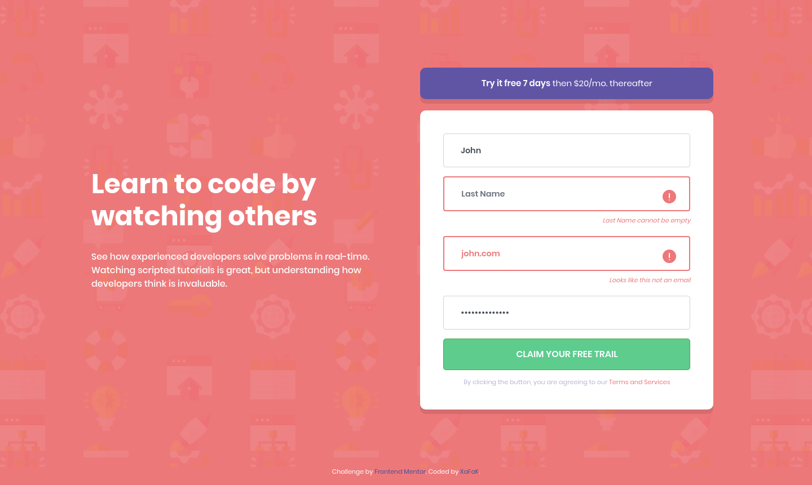

# FrontEndMentor-Intro_Component_With_Signup_Form

## Desktop Preview

## Desktop Preview (Showing incorrect user data entry)

## Mobile Preview

## What is this?

This is a responsive, Mobile-first solution for Intro Component With Signup Form using HTML, CSS Bootstrap Framework and Vanilla Javascript, a challenge from: [Frontend Mentor](https://www.frontendmentor.io).

## Which framework is used in this solution?

This solution uses CSS Bootstrap Framework.

## How can I view the web-page?

[Click here to view the live site]()
Hosted on [Versel](https://vercel.com/)
