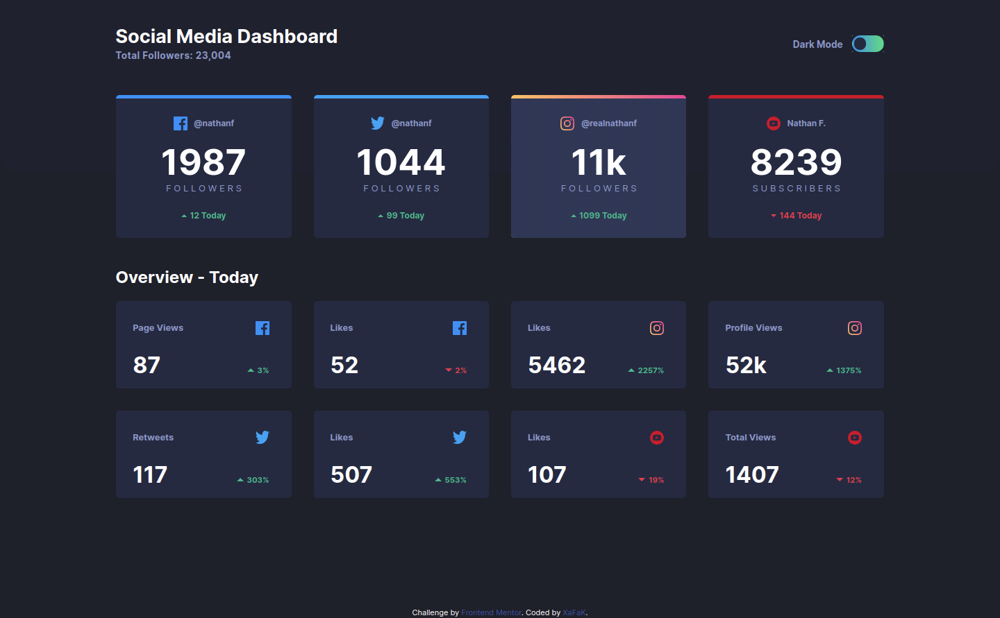
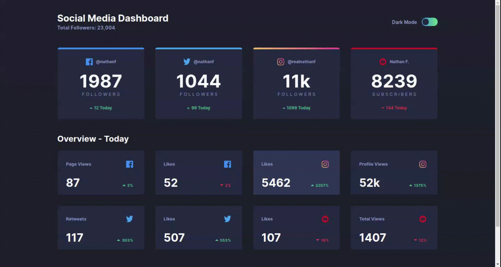
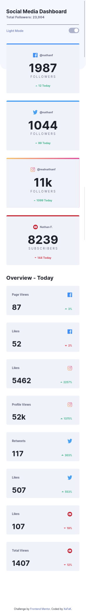
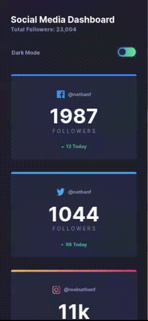

# FrontEndMentor-Social_Media_Dashboard_With_Theme_Switcher

## Desktop Preview

## Desktop Preview Animations

## Mobile Preview

## Mobile Preview Animations

## What is this?

This is a responsive, Mobile-first solution forSocial media dashboard with theme switcher using HTML, CSS Bootstrap Framework and jQuery (Javascript Library), a challenge from: [Frontend Mentor](https://www.frontendmentor.io).

## Which framework/library is used in this solution?

This solution uses CSS Bootstrap Framework and jQuery Javascript Library.

## How can I view the solution?

[Click here to view the live site](https://front-end-mentor-social-media-dashboard-with-theme.now.sh/)
Hosted on [Versel](https://vercel.com/)
